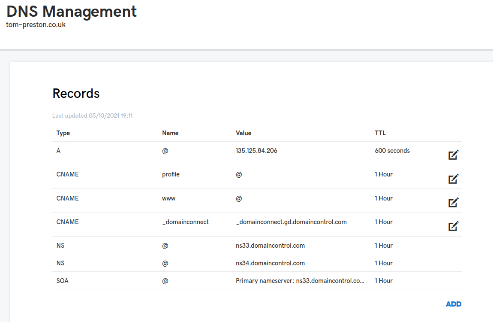

# Ingress

This repo contains a simple ingress setup.  We first deploy an ingress controller, then add rules.

Contents:

- [Ingress](#ingress)
  - [Controller](#controller)
  - [Rule](#rule)
  - [Use with a domain name](#use-with-a-domain-name)
  - [HTTPS](#https)
    - [Cert-manager / Let's encrypt](#cert-manager--lets-encrypt)
    - [add TLS to the deployment](#add-tls-to-the-deployment)
    - [Remarks](#remarks)
    - [Check TLS](#check-tls)
  - [Refs](#refs)

## Controller

```bash
helm repo add ingress-nginx https://kubernetes.github.io/ingress-nginx
helm repo update
kubectl create namespace ingress-tp
helm upgrade --install ingress-nginx --namespace ingress-tp ingress-nginx/ingress-nginx -f controller/ingress_controller.yml
```

## Rule

Add an ingress rule using:

```bash
kubectl apply -f rule/rule.yml
```

## Use with a domain name

We normally want to forward traffic from a domain name to our k8s cluster.  To so this, we need to implement a DNS like so:



Where the ip address for the A record is listed in the ovh dashboard.  `profile` is the name of a subdomain defined in `rule/rule.yml`.

## HTTPS

### Cert-manager / Let's encrypt

Install cert-manager:

```bash
# https://cert-manager.io/docs/installation/
kubectl apply -f https://github.com/jetstack/cert-manager/releases/download/v1.5.3/cert-manager.yaml
```

The first stage is to get a cert.  We do this using [cert-manager](https://cert-manager.io/), which uses [let's encrypt](https://letsencrypt.org/) as a CA.  Following the guide [here](https://medium.com/flant-com/cert-manager-lets-encrypt-ssl-certs-for-kubernetes-7642e463bbce), we just need to:

```bash
kubectl apply -f certs/cert.yml
```

This will create the secret used in tls here: `kubectl get secret tls-secret`

### add TLS to the deployment

HTTPS is set up in the ingress controller `controller/ingress_controller.yml` with the lines as per the [docs](https://kubernetes.io/docs/concepts/services-networking/ingress/#tls):

```bash
spec:
  tls:
  - hosts:
      - tom-preston.co.uk
    secretName: tls-secret
```

### Remarks

- Note that secrets in k8S are only available in the same NS.  Thus is secrets for the TLS must be in the same NS as the ingress controller!
- Ingress rules must reside in the same namespace as their apps.

### Check TLS

```bash
# https://serverfault.com/questions/661978/displaying-a-remote-ssl-certificate-details-using-cli-tools
echo | openssl s_client -showcerts -servername profile.tom-preston.co.uk -connect profile.tom-preston.co.uk:443 2>/dev/null | openssl x509 -inform pem -noout -text
```

## Refs

- [Github](https://github.com/kubernetes/ingress-nginx/tree/main/charts/ingress-nginx)
- [Ingress Nginx Docs](https://kubernetes.github.io/ingress-nginx/)
- [K8s ingress](https://kubernetes.io/docs/concepts/services-networking/ingress/#tls)
- [let's encrypt](https://letsencrypt.org/)
- [cert-manager](https://cert-manager.io/)- [Ingress](#ingress)
